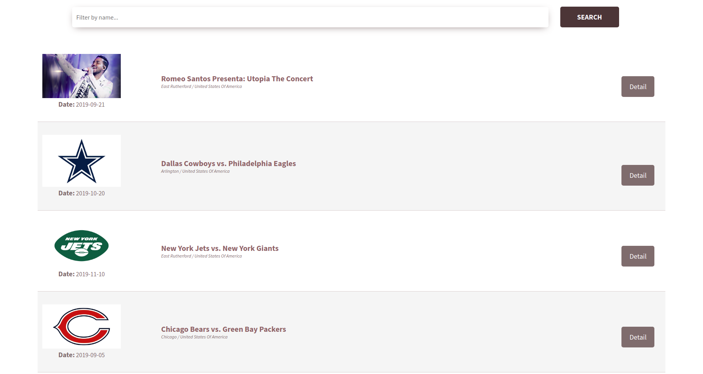
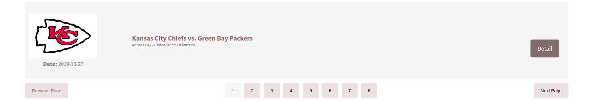
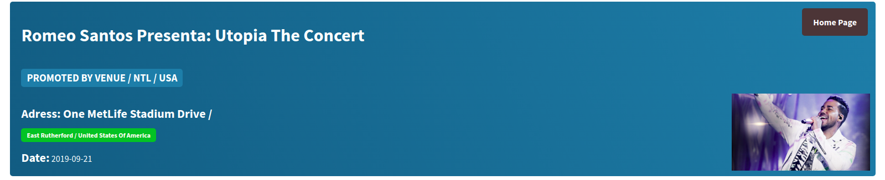

<a href="https://tr.reactjs.org/"></a>

<!-- [](http://fvcproductions.com) -->

***SPA with React Js***

# Ticket Master Events

> A table component with data structure from Ticketmaster's public API services.

**Home Page**




**Pagination**




**Detail Page**



---

## Table of Contents

- [Installation](#installation)
- [How To Run](#how-to-run)
- [Techs](#techs)
- [Maintainer](#maintainer)

---

## Installation

- All the `code` required to get started

### Clone

- Clone this repo to your local machine using with your SSH key  `git clone git@github.com:savasozcan/ticketmaster-events.git`

### Setup

- If you want more syntax highlighting, format your code like this:

> install npm and other packages

```shell
$ npm install
```
---


## How to Run?

### `npm start`

Runs the app in the development mode.<br>
Open [http://localhost:8080](http://localhost:8080) to view it in the browser.

The page will reload if you make edits.<br>
You will also see any lint errors in the console.

### `npm test`

- Used Jest and Enzyme for test.

#### Example for Jest

```javascript
// code away!
describe('event reducer', () => {
    it('should return the initial state', () => {
        expect(eventListReducer(listState, {})).toEqual({
            data: [],
            keyword: "",
            page: {},
            loading: false,
        });
    });
    it('should store the retrieve', () => {
        expect(eventRetrieveReducer(retrieveState, {})).toEqual({
            data: {},
            loading: false,
        });
    });
})
```

#### Example for Enzyme

```javascript
// code away!
import { configure, shallow } from 'enzyme';
import Adapter from 'enzyme-adapter-react-16';

configure({ adapter: new Adapter() });

describe('EventList Component', () => {
    it('should ...', () => {
        const wrapper = shallow(<EventList />);
        expect(wrapper.exists()).toBe(true)
    });
})
```

### `npm run build`

Builds the app for production to the `dist` folder.<br>
It correctly bundles React in production mode and optimizes the build for the best performance.

The build is minified and the filenames include the hashes.<br>
Your app is ready to be deployed!

---

## Techs

- <a href="https://tr.reactjs.org/">React Js</a>
- <a href="https://redux.js.org/">Redux</a>
- <a href="https://www.styled-components.com/">Styled-Component</a>
- <a href="https://fabien-d.github.io/alertify.js/">Alertify Js</a>
- <a href="https://jestjs.io/">Jest</a> - <a href="https://airbnb.io/enzyme/">Enzyme</a>
- <a href="https://webpack.js.org/">Webpack</a>
- <a href="https://www.npmjs.com/">NPM Package</a>

---

## Maintainer

Savaş Özcan <a href="mailto:kenansubasiceng@gmail.com">savasozcan.826@gmail.com</a>

---
